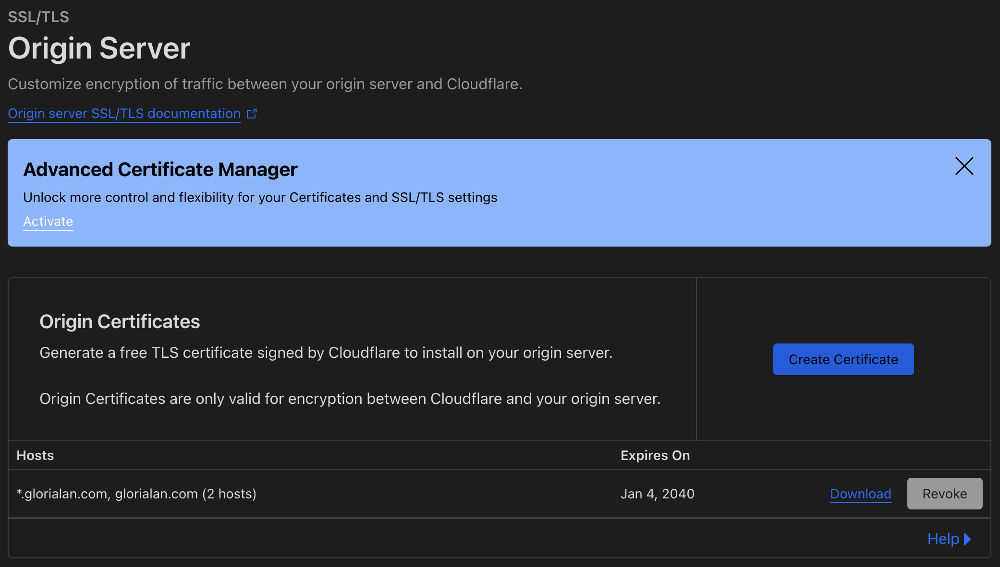

# Backend

| PORT | SERVICE |
| - | - |
| 8000 | API |
| 8080 | Adminer |
| 8081 | MongoExpress |

## Error Checking

| Error code | Description |
| - | - |
| 0 | Username taken | 

### User & Authentication

#### Registration
- Is the username taken?
- UUID conflict (same uuid?)
- 

## Dev Journal

### January 3, 2025

Webpack throughs some errors regarding missing modulels in relation to `mongodb`
dependencies, but don't worry! There are optional modules are we don't need to
install them unless we are using the specific service. Unfortuanately, there is
no way to surpess these warinngs so just have to let them be.

## Note on running scirpts

- `chmod +x filename`
- `./filename.sh`

## Nginx & SSL Setup

Remember to add the sub-domains to your A records and handle them accordingly in
the Nginx config file!

- Generate the certificate and private key for orign server
  
- Save the certificate and private key inside `cert.pem` and `key.pem` respectively

### References

1. https://www.digitalocean.com/community/tutorials/how-to-host-a-website-using-cloudflare-and-nginx-on-ubuntu-22-04
2. 
